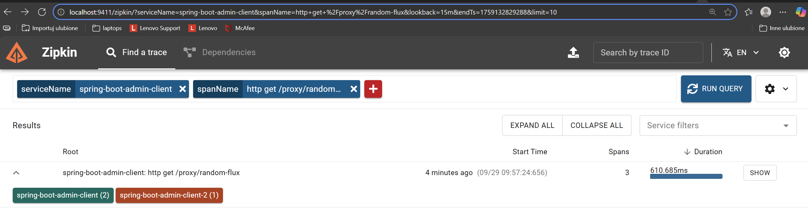
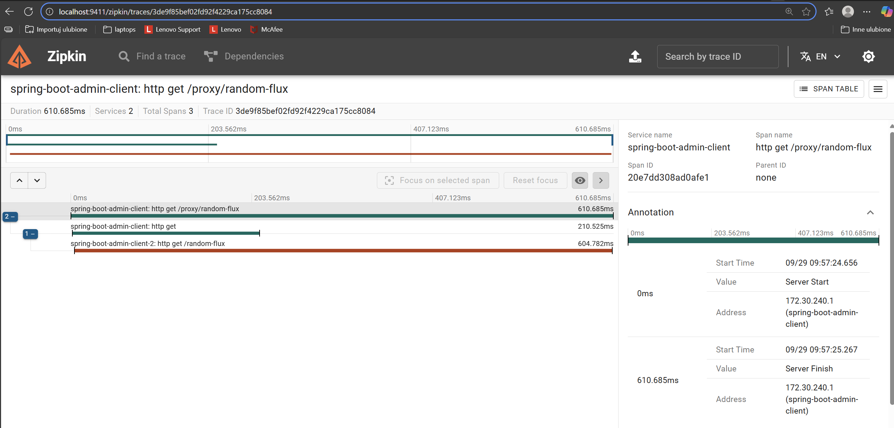

# Getting Started

The project demonstrates how to set up:

## Admin Client and connect it to Admin Server

Spring Boot Admin server can be found here: https://github.com/GolovchenkoA/spring-boot-admin-server

## Distributed tracing using OpenTelemetry And Zimpkin
- [Spring Boot Admin Client 2](https://github.com/GolovchenkoA/spring-boot-admin-client-2) - the microservice it calls to demonstrate how distributed tracing works

- [Auto-Configured WebClient](https://docs.spring.io/spring-boot/reference/actuator/tracing.html#actuator.micrometer-tracing.propagating-traces)
- [Spring Boot Tracing](https://docs.spring.io/spring-boot/reference/actuator/tracing.html)
- [Autoconfigured WebClient Builder](https://docs.spring.io/spring-boot/reference/io/rest-client.html#io.rest-client.webclient) - explains how to add a WebClient to be able to observe its traces. 


# How to
1. Start Spring Boot Admin Client (this project), Start Spring Boot Admin Client 2 and Zipkin

2. Send request which spans 2 microservices

```shell
curl localhost:5000/proxy/random-flux?timeoutSec=5
```
or
```shell
curl localhost:5000/proxy/random-mono
```

3. Open Zipkin `http://localhost:9411`




4. Click 'SHOW' button




# Links
- [Spring Boot  Monitoring and Management](https://docs.spring.io/spring-cloud-dataflow-server-cloudfoundry/docs/1.2.1.BUILD-SNAPSHOT/reference/html/configuration-monitoring-management.html#_spring_boot_admin)
- [Spring Boot Admin Server. Github](https://github.com/codecentric/spring-boot-admin)
